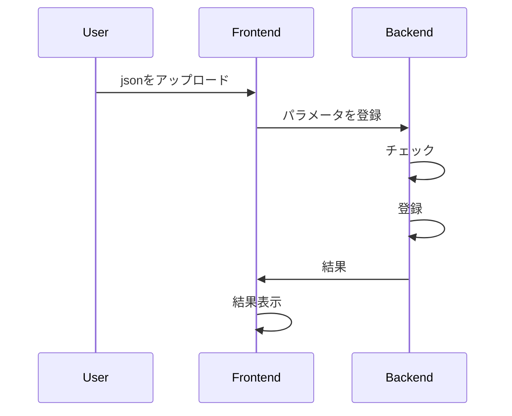

# API Sequence Diagram

## Project Settings
### register sfm camera parameter

### register detect landmark camera parameter

### register detect dot parameter

### register sfm json

### send images for sfm to server

### run sfm

## Trajectory Editor
### register trajectory

## Drone Settings
### set pid

### set trajectory

## Drone Control
### start
### stop
### pause