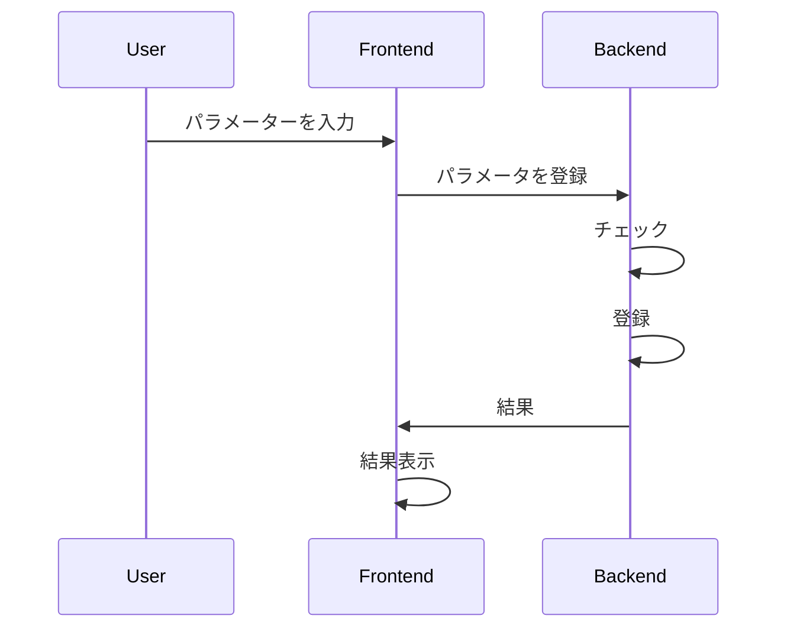
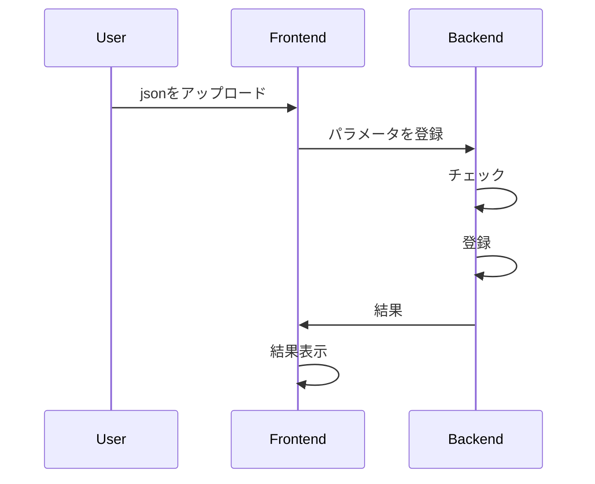

# API Sequence Diagram

## Project Settings
### register sfm camera parameter

### register sfm camera parameter from json

### export sfm camera parameter json

### register detect landmark camera parameter

### register detect dot parameter

### register sfm json

### send images for sfm to server

### run sfm

## Trajectory Editor
### register trajectory
### set trajectory

## Drone Settings
### set pid
### set detect dot parameter
### set trajectory

## Drone Control
### send heartbeat
### read heartbeat
### start
### stop
### pause
