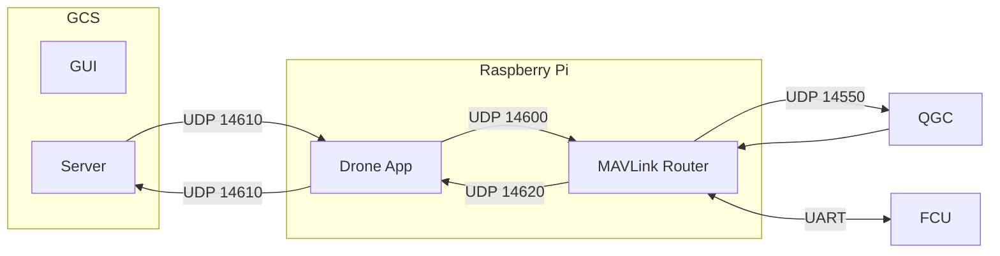
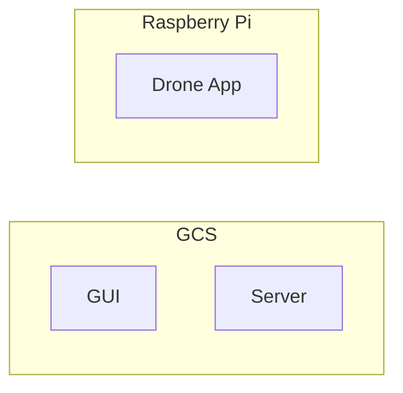

# ネットワーク仕様書

## 構成

```mermaid
flowchart LR

  subgraph GCS["GCS"]
    GUI["GUI"]
    SERVER["Server"]
    end

  subgraph RPI["Raspberry Pi"]
    DAPP["Drone App"]
    ROUTER["MAVLink Router"]
    end

  QGC["QGC"]

  FCU["FCU"]

  SERVER    --> |UDP 14610| DAPP
  DAPP    --> |UDP 14610| SERVER
  ROUTER --> |UDP 14550| QGC
  QGC    --> ROUTER
  DAPP    --> |UDP 14600| ROUTER
  ROUTER --> |UDP 14620| DAPP
  ROUTER <--> |UART|FCU
```

## 制御コマンドフロー
```
```

## 動画ストリーミングフロー

```mermaid
flowchart LR

  subgraph GCS["GCS"]
    GUI["GUI"]
    SERVER["Server"]
    end

  subgraph RPI["Raspberry Pi"]
    DAPP["Drone App"]
    end

  
```